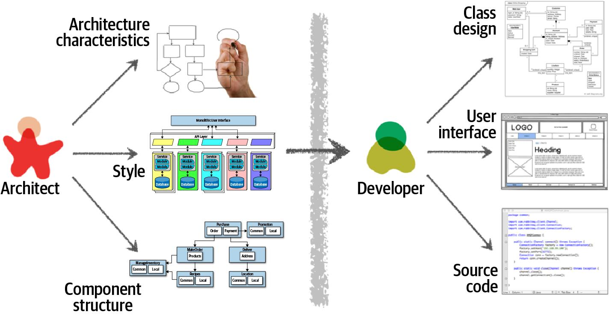

# Fundamentals of Software Architecture 
`Mark Richards and Neal Ford`

## Introduction

Software architecture is about making fundamental structural choices which are costly to change once implemented. "wiki def"

This book is divided into 3 main parts:

- Part 1: Which talks about the foundations. What is needed to become an architect and how to building on it.

- Part 2: Talks about the architecture Styles. The differents styles used to build a software system such (layer, micro-services ...),

- Part 3: Presents the techniques and software required to be a good architect.

### Introduction

#### Definition

Software architecture is a blue-print of a system or a roadmap in building a software system.

SA consist of:

- *Structure*: Which illustrates the architectural style used to construct the system

- Architecture decisions: The rules on how the system should be constructed.

- Design principles: The guide lines for constructing a system. For example development teams should leverage asynchronous messaging between services within a microservices architecture to increase performance.

- Architecture characteristics: Non-functional requirements of the system

#### Expectations of an Architect.

- Make architecture decisions
- Continually analyze the architecture
- Keep current with latest trends
- Ensure compliance with decisions
- Diverse exposure and experience
- Have business domain knowledge
- Possess interpersonal skills
- Understand and navigate politics

#### Laws of Architure

- Everything in software architecture is a trade-off

- Why is more important than how.

### Part 1: Foundation.

#### Architectural Thinking

An architect sees things differently from a developer’s point of view.

The main aspects of Architectural thinking include: 

- understanding the difference between architecture and design and knowing how to collaborate with development teams to make architecture work.

#
#

#
#

#### Technical Breath

#

#

#### Analysing trade-off